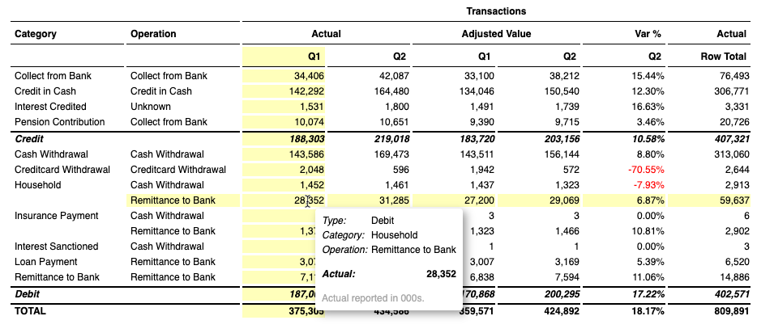
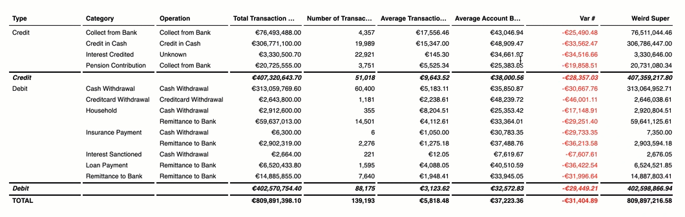
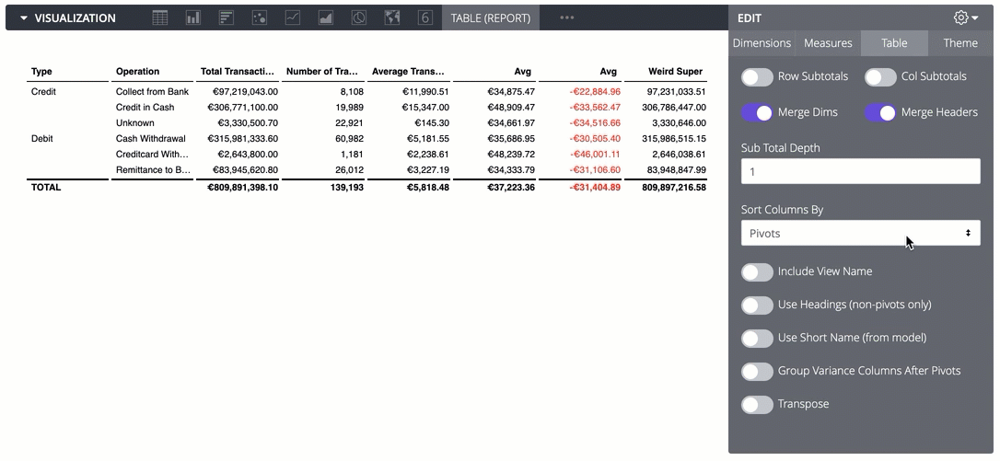
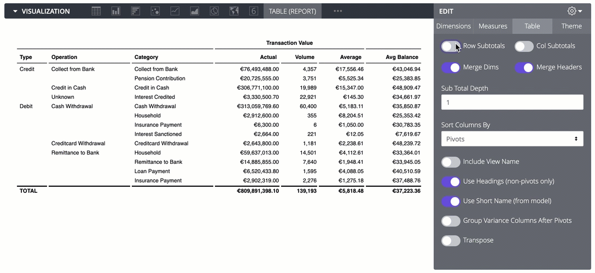
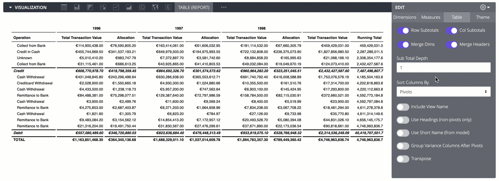
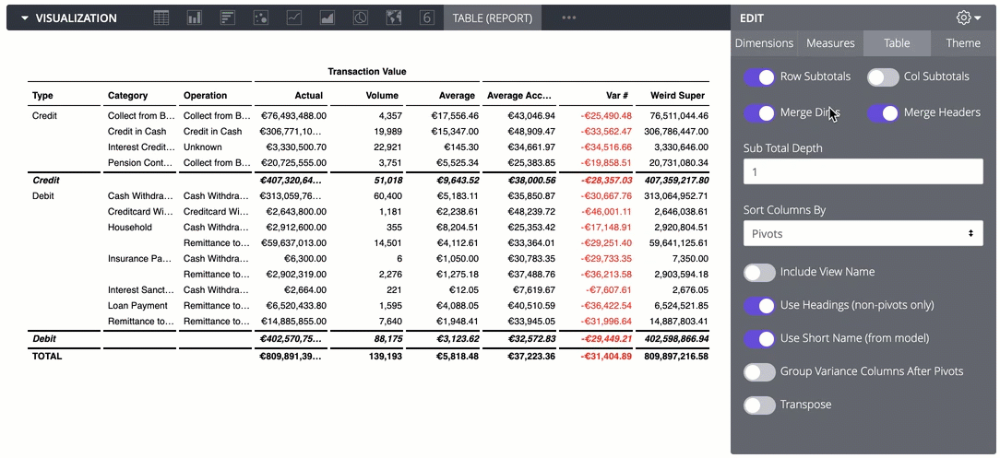
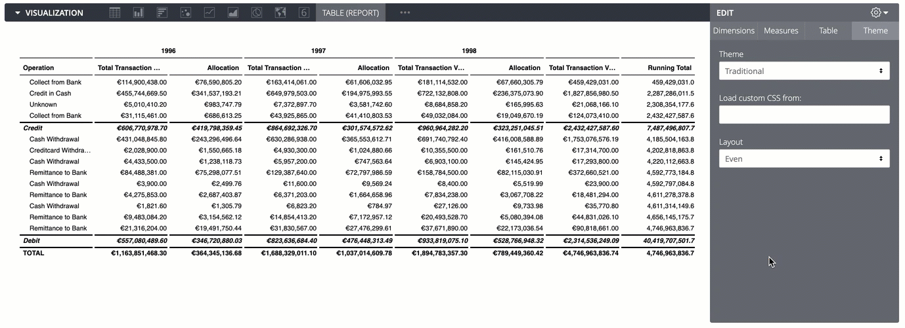
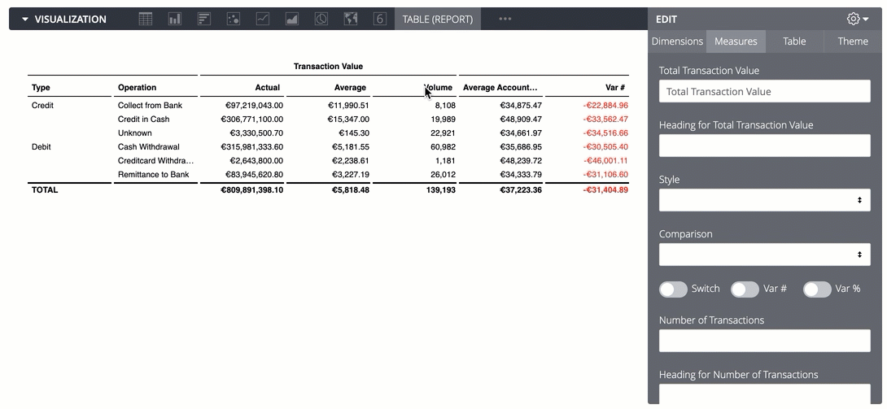
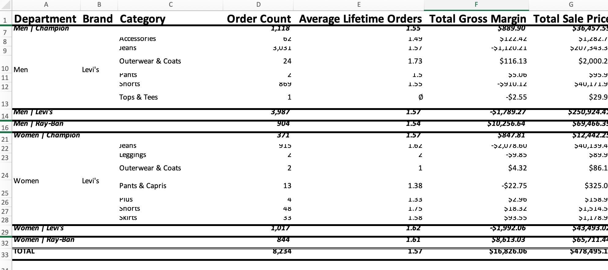

# Report Table for Looker

A table dedicated to single-page, enterprise summary reports. Useful for PDF exports, report packs, finance reporting, etc. Does not do multi-page tables and lists. Does look good for your year-on-year analysis. Originally created by [Jon Walls](https://github.com/ContrastingSounds/vis-report_table).

- Quick variance calculations
- Add subtotals
  - Hierarchical subtotals: set "Sub Total Depth" to `(all)` to add subtotals for all dimension levels
  - Subtotals taken from Looker subtotals if available, otherwise performed as front-end calculation
- Add a header row to non-pivoted tables
- Organise measure columns by pivot value, or by measure

  - Flat tables (i.e. no pivots) can be organised by drag'n'drop
- Transpose (any number of dimensions)
- Easy red/black conditional format
- "Subtotal" format e.g. for highlighting transposed rows of measures
- Themes, including ability to test custom themes using your own css file
- Use LookML tags to give default abbreviations to popular fields
- Reduce to a single dimension value for financial-style reporting
- Drill-to-detail 
- **New: Row Collapsing**
  - Interactive row collapsing: click a subtotal label to toggle its children
  - Configuration option "Start Collapsed" to initialize the table with folded rows
  - Global "Expand All" and "Collapse All" buttons (visible on hover)
- **New: Download to Excel**
  - On-hover download button to export the report as a `.xls` file with all formatting intact

## Examples

*Drag'n'drop columns for flat tables*

*Tags in LookML for consistent headers and abbreviations*

*Subtotals and "show last dimension only"*

*Sort by Pivot or Measure*

*Set headers and labels*

*Even width columns or autolayout*

*Transposing and PnL style reports*

*Exporting to Excel*

## Tagging fields in LookML

A common reporting requirement is grouping fields under headings, and abbreviating column headers when many columns are present. This can be repetitive work! The Report Table vis will pick up tags in the LookML model, with the format `"vis-tools:SETTING:VALUE"`.

The current tag settings available are `heading`, `short_name`, `unit`.

    measure: number_of_transactions {
      tags: [
        "vis-tools:heading:Transaction Value",
        "vis-tools:short_name:Volume",
        "vis-tools:unit:#"
      ]
      type: count
      value_format_name: decimal_0
      drill_fields: [transaction_details*]
    }

## Notes

- Maximum of two pivot fields
- Subtotals calculated without Looker's native total features are only for simple sums & averages
  - e.g. no Count Distincts, running totals, measures of type "number" with arbitrary calculations
  - The visualization will use subtotals from the query response if available
  - The tooltip will alert users to "estimated" numbers

## Contributing

Please see [CONTRIBUTING.md](CONTRIBUTING.md) for information on how to contribute or set up your development environment.
