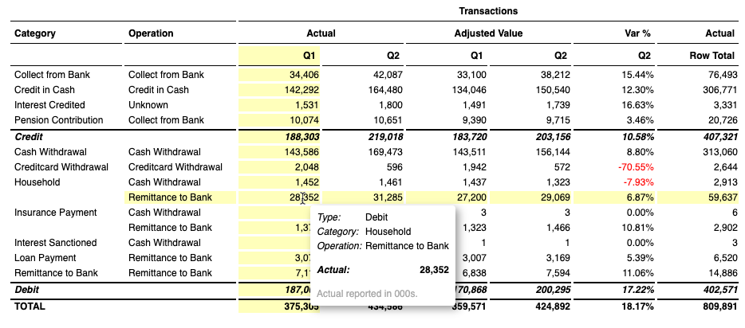
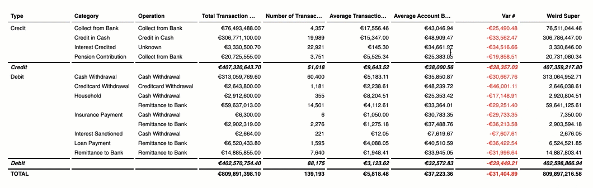
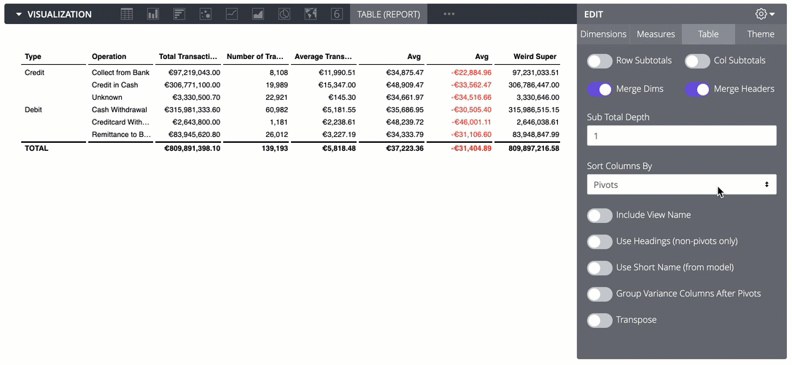
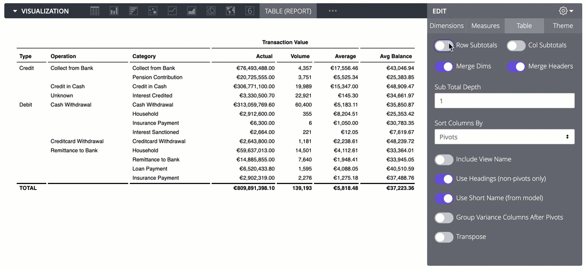
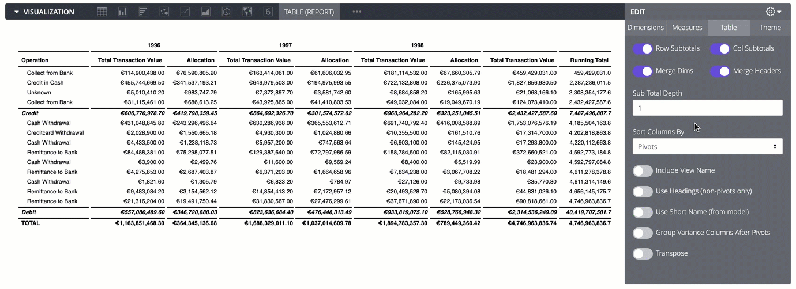
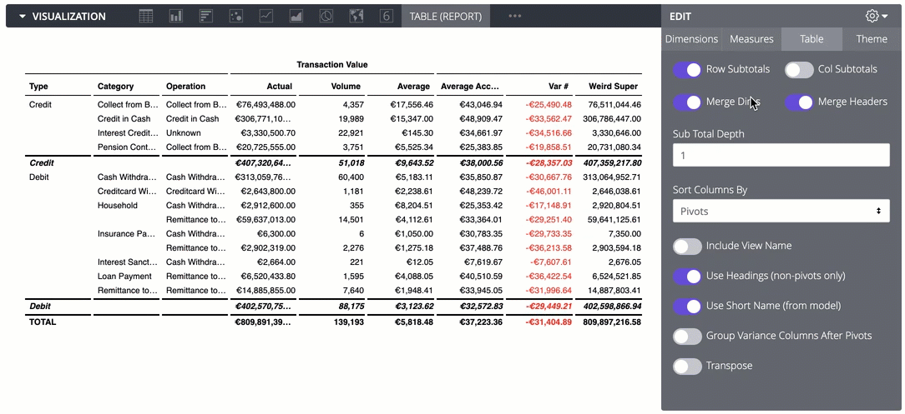
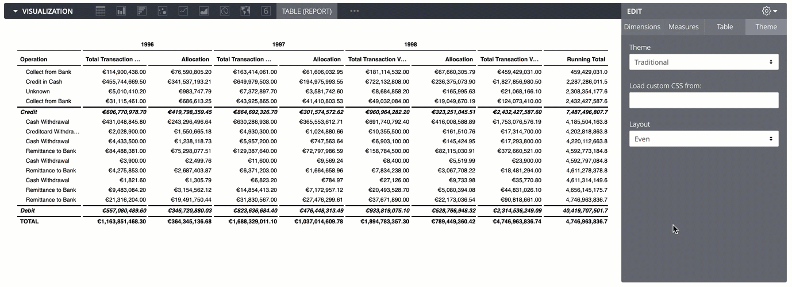
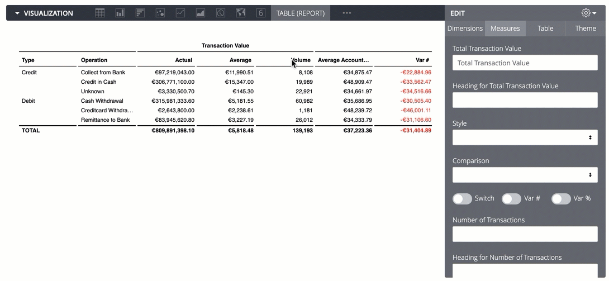
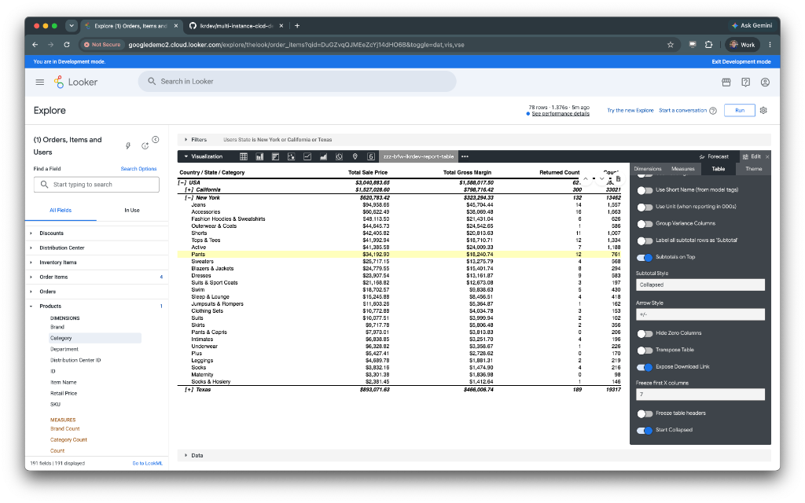

# Report Table for Looker

A table visualization for single-page summary reports in Looker. Built for PDF exports, report packs, and financial reporting. Originally created by [Jon Walls](https://github.com/ContrastingSounds/vis-report_table).



## Features

- Quick variance calculations
- Row and column subtotals (including two pivot levels)
  - Uses Looker query subtotals when available, or calculates them on the client
- Header row for non-pivoted tables
- Column reordering by pivot value or measure
  - Drag and drop column reordering on flat tables
- Dimension transposition
- Red and black conditional formatting
- Subtotal formatting for highlighting transposed measure rows
- Custom CSS themes
- LookML tags for default abbreviations and headers
- Single dimension value reduction for financial reports
- Drill-to-detail support

## Recent updates

- Added an "Allow User Edits" (`allowUserEdits`) option in the **Theme** tab and a floating "Reset Edits" (`#resetEditsBtn`) action button to persist per-user table overrides (collapsed rows, subtotal toggles, column order) across reloads via Looker's Artifacts API (**Extension installation only**).
- Added an "Allow Subtotal Toggle" (`allowSubtotalToggle`) option that exposes a floating Sigma (`Σ`) action button on hover to show or hide row subtotals (`hideSubtotals`) on demand.
- Added collapsed subtotals (`subtotalStyle: 'collapsed'`) with interactive expand and collapse row toggles (`arrowStyle`), hierarchy indentation, and combined header labels.
- Added a "Subtotals on Top" setting to render row subtotals above line items.
- Added an option to freeze the first X columns during horizontal scrolling.
- Added support for dynamic field labels in Looker (`label_from_parameter` and Liquid conditional logic).
- Added a "Hide Null Dimension Columns" option to omit completely null dimension columns and suppress redundant subtotal rows for inactive hierarchy levels.

## Installation

You can install Report Table in your Looker project `manifest.lkml` either as a standard custom visualization or as a Looker Extension visualization.

### Option 1: Custom Visualization (`report_table.js`)

```lookml
visualization: {
  id: "lkrdev-report-table"
  url: "https://cdn.lkr.dev/viz/report-table/latest/report_table.js"
  label: "Report Table"
}
```

### Option 2: Looker Extension Visualization (`report_table_extension.js`)

Installing as a Looker Extension enables SDK-backed features such as **Allow User Edits** (per-user configuration persistence via Looker's Artifacts API):

```lookml
application: report-table-extension {
  label: "Report Table (Extension)"
  url: "https://cdn.lkr.dev/viz/report-table/latest/report_table_extension.js"
  mount_points: {
    dashboard_vis: yes
  }
  entitlements: {
    core_api_methods: ["me", "artifact", "update_artifacts", "delete_artifact"]
  }
}
```

For more details on custom visualizations in Looker, see the Looker documentation on [developing custom visualizations using a project manifest](https://cloud.google.com/looker/docs/developing-custom-visualizations) or managing [Admin panel visualizations](https://cloud.google.com/looker/docs/admin-panel-visualizations).

## Standalone usage outside Looker

You can also use this visualization independently in non-Looker web apps by embedding the compiled `report_table.js` script and calling `window.looker.table()`.

For integration details, method signatures, and payload data formats, see [standalone.md](standalone.md).

## Examples

*Drag and drop columns for flat tables*



*Tags in LookML for consistent headers and abbreviations*



*Subtotals and show last dimension only*



*Sort by pivot or measure*



*Set headers and labels*



*Even width columns or autolayout*



*Transposing and financial reports*



## Collapsed columns and subtotals

When working with multi-level hierarchies (such as Country > State > Category), standard tables often display repeated columns. With collapsed subtotals, multiple dimension columns collapse into a single hierarchical column with visual indentation and expand/collapse controls.



### Configuration options

- Subtotal Style:
  - `Simple`: Standard multi-column layout with subtotal rows.
  - `Collapsed`: Collapses dimension columns into a single column with indentation levels (`subtotal-collapsed-0`, `subtotal-collapsed-1`, etc.) and combines column headers (such as `Country / State / Category`).
- Allow Subtotal Toggle (`allowSubtotalToggle`):
  - When **Row Subtotals** (`rowSubtotals`) is enabled, turning on **Allow Subtotal Toggle** adds a floating Sigma (`Σ`) button (`#toggleSubtotalsBtn`) to the top-right action bar when hovering over the table.
  - Clicking the button toggles `hideSubtotals` between showing and hiding subtotal rows on the fly without modifying the underlying query.
  - If **Allow Subtotal Toggle** is turned off, any hidden toggle state (`hideSubtotals`) is ignored so row subtotals always display when `rowSubtotals` is active.
- Allow User Edits (`allowUserEdits`, **Extension only**):
  - Located at the end of the **Theme** tab. This feature **only works when using the Looker Extension visualization (`report_table_extension.js`)**.
  - When enabled, viewer interactions on a saved Look or Dashboard tile (such as expanding/collapsing rows, toggling subtotals, or reordering columns) are saved per user and per Look/Dashboard tile via Looker's Artifacts API and automatically restored on reload.
  - When **Allow User Edits** is enabled and a viewer has active overrides, a **Reset Edits** button (`#resetEditsBtn`) appears in the top-right floating action bar to clear saved user edits and restore the base Look/Dashboard configuration.
- Save and Apply User Filter State (`allowUserFilters`, **Extension only**):
  - Located in the **Theme** tab below **Allow User Edits**. This feature **only works on Dashboards when using the Looker Extension visualization (`report_table_extension.js`)** and requires `"dashboard_dashboard_filters"` in `manifest.lkml` `entitlements.core_api_methods`.
  - When enabled, filter changes on a Dashboard (`tileHostData.dashboardFilters`) are persisted per user and per Dashboard (`user_${userId}_dashboard_${dashboardId}_filters`) via Looker's Artifacts API.
  - When loading a Dashboard, the extension fetches the dashboard's configured `default_value` for each filter (`dashboard_dashboard_filters`) and applies saved filter values only when the active filter is empty (`""`) or matches the dashboard default—preserving any explicit non-default filter values passed in the URL.
  - If all saved filters already match the active filters (or during headless PDF/PNG renders where `lookerHostData.isRendering` is true), no filter update or query re-run is triggered.
  - Clicking the floating **Reset Edits** button (`#resetEditsBtn`) clears saved filter overrides and restores the Dashboard's initial/default filters.
  - When turned off, per-user overrides are ignored and viewer changes are not persisted.
- Arrow Style:
  - `Arrows`: Displays `▲` / `▼` toggle icons.
  - `+/-`: Displays `[-]` / `[+]` toggle buttons.
- Start Collapsed:
  - When enabled, collapses subtotal groups on initial render. Users can click any row toggle to expand or collapse child groups.

## Dynamic hierarchies and null dimension suppression

Dashboards often implement parameter-driven dynamic hierarchies (such as Level 1: Country, Level 2: Cluster, Level 3: Collection, Level 4: None, Level 5: None).

LookML models typically implement this pattern with a parameter paired with dynamic dimension `label_from_parameter`:

```lookml
parameter: select_level_4 {
  type: unquoted
  allowed_value: { label: "Product Category" value: "category" }
  allowed_value: { label: "Brand"            value: "brand" }
  allowed_value: { label: "None"             value: "none" }
  default_value: "none"
}

dimension: level_4 {
  label_from_parameter: select_level_4
  sql:
    
      ${products.category}
    
      ${products.brand}
    
      NULL
     ;;
}
```

When users select "None", the column header dynamically updates to "None" via `label_from_parameter` and its SQL values evaluate to `NULL`, but the dimension field remains in the query payload.

Without suppression, standard tables render empty `∅` columns with "None" headers and produce redundant subtotal rows that duplicate the leaf line items with trailing separators (such as `Country | Cluster | Collection | `).

### Hide null dimension columns option

Enabling **Hide Null Dimension Columns** (`hideNullDimensionCols` in the Table settings tab) adjusts the table dynamically:

- Hides empty dimension columns where all dataset rows contain `null`, `undefined`, or empty string `""` values.
- Suppresses redundant subtotals by calculating subtotal depths and groupings exclusively over active, non-null dimensions. For example, if levels 4 and 5 evaluate to `NULL` in a 5-dimension query, subtotals generate only for levels 1 (`Country`) and 2 (`Country | Cluster`), treating level 3 (`Collection`) as the line item tier.
- Adapts single-index column mode (`indexColumn`) and collapsed subtotal mode (`subtotalStyle: 'collapsed'`) to the active hierarchy depth without requiring separate Looks or dashboards.

## Tagging fields in LookML

Grouping fields under headings and abbreviating column headers can be repetitive. The Report Table visualization picks up tags in the LookML model using the format `"vis-tools:SETTING:VALUE"`.

Available tag settings include `heading`, `short_name`, and `unit`:

```lookml
measure: number_of_transactions {
  tags: [
    "vis-tools:heading:Transaction Value",
    "vis-tools:short_name:Volume",
    "vis-tools:unit:#"
  ]
  type: count
  value_format_name: decimal_0
  drill_fields: [transaction_details*]
}
```

## Notes

- Maximum of two pivot fields.
- Subtotals calculated on the client handle simple sums and averages.
  - Count distincts, running totals, and custom table calculations rely on Looker query subtotals.
  - The visualization uses subtotals from the query response when available.
  - Tooltips alert users to estimated calculations.

## Using custom CSS

You can apply custom styling by providing a URL to a CSS file in the `Load custom CSS from:` setting and selecting `Use custom theme` in the `Theme` tab.


See [src/theme_custom_template.css](src/theme_custom_template.css) for a starting template.

### Custom styling examples

#### Dark mode

```css
.reportTable {
  background-color: #1a1a1a;
  color: #f5f5f5;
  border: 1px solid #333333;
}
.reportTable th {
  background-color: #242424;
  color: #ffffff;
  border-bottom: 2px solid #64b5f6 !important;
}
.reportTable td {
  color: #e0e0e0;
  border: 1px solid #2a2a2a;
}
.subtotal {
  background: #2d2d2d;
  color: #81c784;
}
#tooltip {
  background-color: #242424;
  border: 1px solid #444444;
  border-radius: 6px;
  box-shadow: 0 6px 16px rgba(0, 0, 0, 0.6);
  color: #f5f5f5;
}
```

#### Card layout

```css
.reportTable {
  font-family: "Inter", Roboto, sans-serif;
  border: none;
  box-shadow: 0 4px 16px rgba(0, 0, 0, 0.06);
  border-radius: 6px;
  overflow: hidden;
}
.reportTable th {
  background: linear-gradient(90deg, #1a365d 0%, #2b6cb0 100%);
  color: #ffffff;
  font-weight: 600;
  text-transform: uppercase;
  font-size: 11px;
  letter-spacing: 0.5px;
}
#tooltip {
  background-color: rgba(255, 255, 255, 0.95);
  backdrop-filter: blur(8px);
  border: 1px solid #e2e8f0;
  border-radius: 8px;
  box-shadow: 0 10px 25px -5px rgba(0, 0, 0, 0.1);
  padding: 8px 12px;
  color: #1a202c;
  font-weight: 500;
}
```

#### Grouped and pivoted column targeting

```css
/* Alternating pivot groups (such as QTD vs YTD) */
#reportTable td.pivot-group-even,
#reportTable th.pivot-group-even {
  background-color: #ececec;
}
#reportTable td.pivot-group-odd,
#reportTable th.pivot-group-odd {
  background-color: #ffffff;
}

/* Target a specific pivot group index directly */
#reportTable .pivot-group-0 {
  border-left: 2px solid #006b9b;
}
```

#### Targeting the last rows

```css
/* Highlight the last 4 rows (such as summary or grand total rows) */
#reportTable tbody tr:nth-last-child(-n + 4) td {
  background-color: #f0f0f0 !important;
  font-weight: bold;
}
```

#### Alternating row shading

```css
#reportTable tbody tr:nth-child(even) td {
  background-color: #f8f9fa;
}
#reportTable tbody tr:nth-child(odd) td {
  background-color: #ffffff;
}
```

#### Top-aligning table cell content

```css
.reportTable th,
.reportTable td {
  vertical-align: top;
}
```

#### Targeting flipped subtotals

When the **Subtotals on Top** option is enabled, `.subtotal-top` and `.subtotals-on-top` classes are applied to `#reportTable`, subtotal rows (`<tr>`), and subtotal cells (`<td>`).

```css
#reportTable tr.subtotal-top td {
  background-color: #e3f2fd !important;
  font-weight: bold;
}
```

### Hosting custom CSS

To load external CSS into Looker, the stylesheet must be served over HTTPS with CORS headers (`Access-Control-Allow-Origin: *`) and a `Content-Type: text/css` header.

Direct links to raw GitHub files (such as `raw.githubusercontent.com`) fail because GitHub sends an `X-Content-Type-Options: nosniff` header with a `text/plain` MIME type. Pass the link through a proxy service such as jsDelivr or Githack, or host the file on Google Cloud Storage with public read access and CORS enabled.

## Feedback and contributions

To report an issue or suggest an improvement, please submit a request at help.looker.com.

### Development quickstart

1. Install dependencies:

   ```bash
   yarn install
   ```

2. Make changes to the source code under `/src`.

3. Compile the bundle:

   ```bash
   yarn build
   ```

   Or run the file watcher during development:

   ```bash
   yarn watch
   ```

### Project structure

- `./report_table.js`: Minified distribution file.
- `manifest.lkml`: Looker external dependencies configuration file defining the visualization object.
- `marketplace.json`: Looker Marketplace package configuration.
- `src/`: Visualization source files.
- `src/report_table.js`: Main entry point for the visualization.
- `tests/`: Jest test suites.

